# AI Course Generator — Updated Technical Documentation

> **Version**: 2.0 (Updated February 2026)
> **Previous Version**: 1.0 (Initial Release — Course Generation + Interactive Learning MVP)
> **Platform**: Android (Kotlin/Jetpack Compose) + Node.js Backend + Firebase/Firestore

---

## Table of Contents

1. [Project Overview](#1-project-overview)
2. [System Architecture](#2-system-architecture)
3. [Technology Stack](#3-technology-stack)
4. [Authentication & Security](#4-authentication--security)
5. [Core Module: Course Generation](#5-core-module-course-generation)
6. [Interactive Learning System](#6-interactive-learning-system)
7. [Flashcard System (SM-2 Spaced Repetition)](#7-flashcard-system-sm-2-spaced-repetition)
8. [AI Notes Generator](#8-ai-notes-generator)
9. [Audio Overview Generation](#9-audio-overview-generation)
10. [AI Tutor Chat (Study Companion)](#10-ai-tutor-chat-study-companion)
11. [User Profiles & Social (Learning Network)](#11-user-profiles--social-learning-network)
12. [Course Search & Discovery](#12-course-search--discovery)
13. [Analytics & Gamification](#13-analytics--gamification)
14. [Interactive Hub (Feature Aggregation)](#14-interactive-hub-feature-aggregation)
15. [Firebase Firestore Data Model (ER Diagram)](#15-firebase-firestore-data-model)
16. [API Reference](#16-api-reference)
17. [Android Screen Architecture](#17-android-screen-architecture)
18. [Theoretical Foundations](#18-theoretical-foundations)
19. [Future Scope](#19-future-scope)

---

## 1. Project Overview

### 1.1 Problem Statement

Traditional e-learning platforms deliver static, one-size-fits-all content. Students often lack interactive engagement, personalised revision tools, and context-aware assistance — the three pillars research identifies as critical for effective long-term retention (Ebbinghaus, 1885; Pashler et al., 2007).

### 1.2 Proposed Solution

**AI Course Generator** is a mobile-first intelligent learning platform that uses Large Language Models (LLMs) to dynamically generate entire course structures — outlines, content, quizzes, flashcards, study notes, and audio overviews — from a single topic description. Every learning artefact is AI-generated on demand, ensuring fresh, contextually relevant material.

### 1.3 Key Differentiators (v2.0)

| Feature | Description |
|---|---|
| **Multi-LLM Architecture** | Supports Gemini, Groq, Cerebras, and GLM — user-selectable per request |
| **Content-First Interactive Learning** | Read-then-quiz flow with hearts system and XP rewards |
| **SM-2 Spaced Repetition Flashcards** | Science-backed review scheduling for long-term retention |
| **Why-Based AI Notes** | 80-20 rule deep learning notes with problem-solution narrative |
| **Conversational Audio Overviews** | TTS-synthesized podcast-style audio with vocal directions |
| **Context-Aware AI Tutor** | Chat companion that only answers within course/subtopic context |
| **Learning Network** | Social features — follow learners, view profiles, discover creators |
| **Real-Time Generation** | SSE streaming for live content generation progress |

### 1.4 Objectives

1. **Generate** complete, structured courses from natural language descriptions using LLMs.
2. **Engage** learners through interactive quizzes, flashcards, and chat-based tutoring.
3. **Retain** knowledge using spaced repetition algorithms and multi-modal content (text, audio, cards).
4. **Connect** learners through a social learning network to encourage peer discovery.
5. **Track** progress through gamification, analytics, and streaks.

---

## 2. System Architecture

### 2.1 High-Level Architecture

```
┌─────────────────────────────────────────────────┐
│                 Android Client                   │
│  (Kotlin · Jetpack Compose · MVVM · ExoPlayer)  │
└──────────────────────┬──────────────────────────┘
                       │ HTTPS (JWT Bearer)
                       ▼
┌─────────────────────────────────────────────────┐
│               Node.js / Express API              │
│        (REST + SSE Streaming Endpoints)          │
│                                                   │
│  ┌──────────┐ ┌──────────┐ ┌──────────────────┐ │
│  │   Auth    │ │  Course  │ │  Interactive     │ │
│  │Controller │ │Controller│ │  Controller      │ │
│  └──────────┘ └──────────┘ └──────────────────┘ │
│  ┌──────────┐ ┌──────────┐ ┌──────────────────┐ │
│  │Flashcard │ │  Notes   │ │  Audio           │ │
│  │Controller │ │Controller│ │  Controller      │ │
│  └──────────┘ └──────────┘ └──────────────────┘ │
│  ┌──────────┐ ┌──────────┐ ┌──────────────────┐ │
│  │  User    │ │Analytics │ │  Gamification    │ │
│  │Controller │ │Controller│ │  Controller      │ │
│  └──────────┘ └──────────┘ └──────────────────┘ │
└───────┬──────────┬──────────┬───────────────────┘
        │          │          │
        ▼          ▼          ▼
┌──────────┐ ┌──────────┐ ┌──────────┐
│ Firebase │ │   LLM    │ │ ImageKit │
│Firestore │ │Providers │ │   CDN    │
│  + Auth  │ │(4 APIs)  │ │(Audio)   │
└──────────┘ └──────────┘ └──────────┘
```

### 2.2 Backend Module Architecture

```
backend/
├── index.js                    # Express app entry, route registration
├── db/firebase.js              # Firebase Admin SDK initialisation
├── middleware/
│   ├── authMiddleware.js       # JWT verification middleware
│   └── adminMiddleware.js      # Admin role guard
├── models/
│   ├── Course.js               # Course data model (nested subcollections)
│   ├── User.js                 # User CRUD + Firebase Auth bridge
│   └── GlobalSettings.js       # App-wide config (providers, defaults)
├── controller/
│   ├── auth.js                 # Register, Login, Logout, Token Refresh
│   ├── course.js               # 21 endpoints — CRUD, generation, search, enrollment
│   ├── interactiveController.js # 11 endpoints — quiz, chat, hub, progress
│   ├── flashcardController.js  # 3 endpoints — generate, review, due cards
│   ├── notesController.js      # 3 endpoints — generate, export subtopic/course
│   ├── audioController.js      # 4 endpoints — generate, stream, download
│   ├── userController.js       # 7 endpoints — profile, follow/unfollow
│   ├── analyticsController.js  # 3 endpoints — summary, course, weekly
│   └── gamificationController.js # 2 endpoints — stats, activity ping
├── prompts/                    # LLM system prompts (outline, content, quiz, notes, audio, flashcard)
├── llm/                        # Zod validation schemas for LLM responses
├── providers/LLMProviders.js   # Multi-provider LLM abstraction layer
├── service/                    # Per-provider API integrations (Gemini, Groq, Cerebras, GLM, TTS)
├── routes/                     # Express route definitions per module
└── utils/                      # Helpers (firestoreSerializer, retry logic)
```

### 2.3 Android Module Architecture (MVVM)

```
app/src/main/java/com/example/jetpackdemo/
├── data/
│   ├── api/
│   │   ├── ApiService.kt          # Retrofit interface (66 endpoints)
│   │   └── RetrofitClient.kt      # Retrofit + OkHttp + Auth interceptor
│   ├── model/
│   │   ├── CourseModels.kt         # Course, Unit, Subtopic, Video, Outline...
│   │   ├── UserModels.kt           # UserProfile, FollowUser, FollowResponse...
│   │   ├── InteractiveModels.kt    # Quiz, Session, ChatMessage...
│   │   └── Respose.kt             # Flashcard, Notes, Audio response models
│   └── repository/
│       ├── CourseRepository.kt
│       ├── UserRepository.kt
│       ├── FlashcardRepository.kt
│       ├── NotesRepository.kt
│       ├── AudioRepository.kt
│       └── InteractiveRepository.kt
├── viewmodels/
│   ├── CourseViewModel.kt          # Course CRUD, generation, enrollment, search
│   ├── UserViewModel.kt            # Profile, follow/unfollow, social
│   ├── InteractiveViewModel.kt     # Quiz flow, content-first, chat
│   ├── FlashcardViewModel.kt       # Flashcard loading, SM-2 review
│   ├── NotesViewModel.kt           # Notes generation, caching
│   ├── AudioViewModel.kt           # Audio generation, playback state
│   └── AdminViewModel.kt           # Admin operations
├── shared_pref/
│   └── UserPreferencesManager.kt   # Local token + user data caching
├── utils/
│   └── TokenManager.kt             # JWT token storage + refresh
├── ui/
│   ├── theme/AppColors.kt          # App-wide colour system
│   └── components/
│       └── PremiumCourseCard.kt    # Reusable course card component
├── NavGraph.kt                     # Top-level navigation (auth flow + main routes)
├── HomeScreen.kt                   # Bottom navigation host + search + discover
├── InteractiveLearningScreen.kt    # Content-first quiz flow
├── InteractiveHubScreen.kt         # Per-subtopic tools + history
├── FlashcardScreen.kt              # Animated flashcard review
├── SummaryNotesScreen.kt           # AI notes viewer
├── AudioOverviewScreen.kt          # ExoPlayer audio player
├── TutorChatScreen.kt              # AI tutor chat interface
├── CreatorProfileScreen.kt         # View other user profiles
├── UserProfileScreen.kt            # Own profile + settings
├── PublicCoursesScreen.kt          # Browse public courses
├── CoursePreviewScreen.kt          # Course preview before enrollment
└── ...                             # Auth screens, Admin screens, etc.
```

---

## 3. Technology Stack

### 3.1 Frontend (Android)

| Technology | Purpose | Version |
|---|---|---|
| **Kotlin** | Primary language | 1.9+ |
| **Jetpack Compose** | Declarative UI framework | Material3 |
| **Navigation Compose** | Type-safe screen navigation | — |
| **Retrofit2** | HTTP client for REST API | 2.9+ |
| **Gson** | JSON serialization/deserialization | — |
| **ExoPlayer (Media3)** | Audio playback engine | 1.3.1 |
| **Coil Compose** | Async image loading (profile pictures) | — |
| **StateFlow + LiveData** | Reactive state management | — |
| **ViewModel** | Lifecycle-aware data holders (MVVM) | — |

### 3.2 Backend

| Technology | Purpose |
|---|---|
| **Node.js + Express** | REST API server |
| **Firebase Admin SDK** | Firestore access + Auth user management |
| **Firebase Authentication** | User identity + password verification (Identity Toolkit REST API) |
| **Cloud Firestore** | NoSQL document database (25+ collections) |
| **Zod** | Runtime schema validation for LLM responses |
| **JWT (jsonwebtoken)** | Stateless authentication with refresh token rotation |
| **ImageKit SDK** | CDN upload & delivery for generated audio files |
| **bcryptjs** | Refresh token hashing |
| **SSE (Server-Sent Events)** | Real-time content generation streaming |

### 3.3 LLM Providers

| Provider | Use Cases | Key Characteristics |
|---|---|---|
| **Google Gemini** | Outlines, content, notes, flashcards | High quality, structured JSON output |
| **Groq** | Fast inference for quizzes, chat | Ultra-low latency (LPU hardware) |
| **Cerebras** | Full-course generation | Fastest bulk generation |
| **GLM (Zhipu AI)** | Alternative provider | Chinese + English support |

### 3.4 External Services

| Service | Purpose |
|---|---|
| **ImageKit** | Audio file CDN — upload, store, stream WAV files |
| **TTS Service** | Text-to-Speech synthesis (WAV generation from scripts) |
| **YouTube Data API** | Optional video attachment for subtopics |
| **ngrok** | Development tunnelling for mobile → localhost API |

---

## 4. Authentication & Security

### 4.1 Auth Flow

The system implements a **JWT-based authentication with refresh token rotation** pattern — considered a best practice for mobile applications (RFC 6749, OAuth 2.0).

```
Client                          Server                    Firebase Auth
  │                                │                           │
  │──── POST /auth/register ──────→│                           │
  │     {email,password,username}  │──── createUser() ────────→│
  │                                │←── uid ──────────────────│
  │                                │── Create Firestore doc ──→│
  │←── {access_token, refresh} ───│                           │
  │                                │                           │
  │──── POST /auth/login ─────────→│                           │
  │     {email, password}          │── verifyPassword (REST) ─→│
  │                                │←── idToken ──────────────│
  │                                │── Hash & store refresh ──→│
  │←── {access_token, refresh} ───│                           │
  │                                │                           │
  │──── Any API (Bearer token) ───→│                           │
  │     Authorization: Bearer xxx  │── jwt.verify() ──────────│
  │←── Response ──────────────────│                           │
  │                                │                           │
  │──── POST /auth/refresh ───────→│                           │
  │     {refreshToken}             │── Verify stored hash ────│
  │                                │── Revoke old token ──────│
  │                                │── Issue new pair ────────│
  │←── {new_access, new_refresh} ─│                           │
```

### 4.2 Token Rotation Security

- Refresh tokens are **hashed with bcrypt** before storage in Firestore
- Each refresh operation **revokes the old token** and issues a new pair
- Tokens are stored in the user's Firestore document as an array of `{ token_hash, created_at, revoked }`
- Prevents replay attacks — a stolen refresh token can only be used once

### 4.3 Role-Based Access Control

| Role | Capabilities |
|---|---|
| **user** | Create courses, enroll, interactive learning, flashcards, notes, audio, chat, social |
| **admin** | All user capabilities + manage all courses, update global settings, configure LLM providers |

---

## 5. Core Module: Course Generation

### 5.1 Generation Pipeline

```
User Input → Outline Generation (LLM) → Review/Edit → Content Generation → Enrollment
    │               │                         │               │
    │     "Machine Learning              Edit units/       LLM generates
    │      for Beginners"               subtopics         content per
    │      3 units                                        subtopic
    │      Intermediate                                   (sequential or
    │                                                      SSE streaming)
```

### 5.2 Outline Generation

The user provides:
- **Course title** and description
- **Number of units** (1-10)
- **Difficulty** (Beginner / Intermediate / Advanced)
- **Include YouTube videos** (optional)
- **LLM provider** preference

The system generates a structured outline via the selected LLM provider, creating:
- A `courses` document with metadata
- Nested `units` subcollection (ordered by position)
- Nested `subtopics` subcollection per unit

### 5.3 Content Generation Modes

| Mode | Endpoint | Description |
|---|---|---|
| **Sequential** | `POST /generate-content` | Generates one subtopic at a time, background queue |
| **SSE Streaming** | `POST /generate-content-stream` | Real-time Server-Sent Events — client sees progress live |
| **Batch (Cerebras)** | Internal | Fast bulk generation for all subtopics at once |
| **Retry Failed** | `POST /retry-failed-subtopics` | Re-attempts only failed subtopics |

### 5.4 Generated Content Structure

Each subtopic gets rich, structured content:

```json
{
  "subtopic_title": "Gradient Descent Optimization",
  "why_this_matters": "Understanding how...",
  "core_concepts": [
    { "name": "Learning Rate", "explanation": "..." },
    { "name": "Loss Function", "explanation": "..." }
  ],
  "examples": [
    { "scenario": "...", "solution": "..." }
  ],
  "code_or_math": {
    "language": "python",
    "snippet": "...",
    "explanation": "..."
  }
}
```

---

## 6. Interactive Learning System

### 6.1 Content-First Learning Flow

The interactive system implements a **content-first, quiz-second** pedagogical approach based on the Testing Effect (Roediger & Butler, 2011) — students who are tested after studying retain information longer.

```
                    ┌──────────────┐
                    │  Load Next   │
                    │  Subtopic    │
                    └──────┬───────┘
                           │
                    ┌──────▼───────┐
                    │   READING    │  ← Student reads AI-generated content
                    │   PHASE      │     (why it matters, core concepts,
                    │              │      examples, code)
                    └──────┬───────┘
                           │ "I'm Ready"
                    ┌──────▼───────┐
                    │    QUIZ      │  ← 3-5 MCQ questions from the content
                    │    PHASE     │     Hearts system (start with 3 ❤️)
                    │              │     Lose 1 heart per wrong answer
                    └──────┬───────┘
                           │
                    ┌──────▼───────┐
                    │   RESULTS    │  ← Score, XP earned (50 base + 100 perfect)
                    │              │     Option: Open InteractiveHub
                    │              │     Option: Continue to next subtopic
                    └──────┬───────┘
                           │
                    ┌──────▼───────┐
                    │   HUB or     │  ← Flashcards, Notes, Audio, Chat
                    │   NEXT       │     or proceed sequentially
                    └──────────────┘
```

### 6.2 Hearts System

- Each quiz session starts with **3 hearts (❤️)**
- Wrong answer = lose 1 heart
- 0 hearts = session ends (can retry)
- All correct = **Perfect Bonus** (+100 XP on top of base 50 XP)

### 6.3 Client-Side Answer Verification

Answers are verified client-side for instant feedback, with server-side validation on final submission. The `/quiz` endpoint returns correct answers and explanations, while `/submit-quiz` performs the authoritative scoring and XP grant.

---

## 7. Flashcard System (SM-2 Spaced Repetition)

### 7.1 Theoretical Background

The system implements the **SM-2 (SuperMemo 2) algorithm** (Wozniak, 1990), one of the most widely adopted spaced repetition algorithms. The core principle is the **spacing effect** — reviews spaced at increasing intervals produce significantly better long-term retention than massed practice (Cepeda et al., 2006).

### 7.2 SM-2 Algorithm Implementation

```
Input:  quality (0-5 rating from user review)
        Previous: ease_factor, repetitions, interval_days

If quality >= 3 (correct):
    If repetitions == 0: interval = 1 day
    If repetitions == 1: interval = 6 days
    Else: interval = previous_interval × ease_factor
    repetitions += 1
Else (incorrect):
    repetitions = 0
    interval = 1 day

ease_factor = max(1.3, ease_factor + (0.1 - (5-quality) × (0.08 + (5-quality) × 0.02)))
next_review_at = now + interval days
```

### 7.3 Flashcard Types

| Type | Front (Question) | Back (Answer) |
|---|---|---|
| **term** | "Define: Gradient Descent" | "An optimisation algorithm that..." |
| **concept** | "Why does batch size affect training?" | "Larger batches provide more stable..." |
| **code** | "What does `model.fit()` do?" | "Trains the model on the provided data..." |

### 7.4 Flow

```
Subtopic Hub → "Flashcards" → GET /flashcards/:subtopicId
                                    │
                              ┌─────▼─────┐
                              │ LLM generates │ (if first time)
                              │  5-10 cards   │
                              └─────┬─────┘
                                    │
                              ┌─────▼─────┐
                              │ Card Display │  ← Animated flip card UI
                              │ Front → Back │     (graphicsLayer rotation)
                              └─────┬─────┘
                                    │
                              ┌─────▼───────────┐
                              │ POST /review     │  ← quality: 0-5
                              │ SM-2 calculation │
                              │ next_review_at   │
                              └─────────────────┘
```

### 7.5 Due Cards System

The `GET /flashcards/course/:courseId/due` endpoint returns all flashcards across a course where:
- The card has never been reviewed, OR
- `next_review_at <= current timestamp`

This enables a "Daily Review" feature where learners review all due cards in one session.

---

## 8. AI Notes Generator

### 8.1 Pedagogical Approach

The notes system uses a **"Why-Based Learning" framework with the 80-20 rule** (Pareto Principle) — focusing on the 20% of knowledge that provides 80% of understanding.

Instead of dry, encyclopaedic notes, the system generates a **narrative arc**:

```
The Problem → Previous Approaches → The Solution → Key Points → Analogy → Examples
```

This mirrors how experts actually think about problems (Chi, Glaser & Rees, 1982) and aligns with **constructivist learning theory** — learners build understanding by connecting new knowledge to existing frameworks.

### 8.2 Generated Notes Structure

| Section | Purpose | Cognitive Function |
|---|---|---|
| **summary** | 2-3 sentence TL;DR | Advance organiser (Ausubel, 1968) |
| **the_problem** | What problem existed before? | Creates a "need to know" (motivation) |
| **previous_approaches** | What was tried before? | Establishes context, shows evolution |
| **the_solution** | How the current approach works | Core learning content |
| **key_points** | Critical takeaways (80-20 rule) | Chunking (Miller, 1956) |
| **analogy** | Real-world comparison | Analogical reasoning |
| **real_world_example** | Concrete application | Transfer of learning |
| **technical_example** | Code/formula with explanation | Procedural knowledge |
| **workflow** | Step-by-step process | Sequencing |
| **common_mistakes** | Beginner pitfalls | Error anticipation |
| **common_confusions** | Similar concepts differentiated | Discrimination learning |
| **mini_qa** | 3-5 Q&A pairs | Self-testing (testing effect) |

### 8.3 Export Capabilities

- **Single subtopic export** → Markdown or JSON
- **Full course export** → Single Markdown document with all units/subtopics, generation coverage stats

---

## 9. Audio Overview Generation

### 9.1 Design Philosophy

The audio system generates **podcast-style conversational overviews** rather than formal lectures. Research shows that conversational tone in educational audio increases engagement and parasocial interaction, leading to better learning outcomes (Mayer, 2009 — Personalisation Principle).

### 9.2 Generation Pipeline

```
Subtopic Content → LLM (Script Generation) → TTS (Speech Synthesis) → ImageKit (CDN Upload)
                          │                         │                        │
                   Generates segments         Synthesises WAV         Stores & serves
                   with vocal directions      from script text        via CDN URL
                   [cheerful], [excited]       "autumn" voice
                   ~15-30 segments
                   ~2-4 minutes
```

### 9.3 Orpheus Vocal Directions

The audio scripts use a proprietary vocal direction system to control TTS emotion:

| Direction | Use Case | Example |
|---|---|---|
| `[cheerful]` | Welcome, positive moments | "Hey there! Welcome back." |
| `[excited]` | Revealing something cool | "And once you get this, everything clicks!" |
| `[warm]` | Encouragement | "You're doing great so far." |
| `[thoughtful]` | Complex explanations | "Hmm, so think about it this way..." |
| `[casual]` | Asides, fillers | "You know what I mean?" |
| `[dramatic]` | Important emphasis | "This changes everything." |

### 9.4 Audio Levels

| Level | Endpoint | Content |
|---|---|---|
| **Subtopic Audio** | `GET /audio/:subtopicId` | Deep-dive on a single subtopic |
| **Course Audio** | `GET /audio/course/:courseId` | High-level overview of all units |

### 9.5 Playback Architecture (Android)

The Android client uses **ExoPlayer (Media3 1.3.1)** for audio playback with:
- Streaming from ImageKit CDN URL
- Automatic recovery: if CDN URL returns 404/410/403, backend re-generates and re-uploads
- Play/pause controls, progress slider, duration display

---

## 10. AI Tutor Chat (Study Companion)

### 10.1 Context-Aware Conversational AI

The AI Tutor is a **context-restricted chat interface** — it only answers questions within the scope of the current subtopic or course. This prevents the AI from becoming a general-purpose assistant and keeps the learning focused.

### 10.2 Chat Modes

| Mode | Scope | Persistence | Context Window |
|---|---|---|---|
| **Subtopic Chat** | Single subtopic | Per-message logging | Subtopic content + title |
| **Course Chat** | Entire course | Session-based (last 12 messages) | Course structure + active subtopic |

### 10.3 Course Chat Memory

Course-level chat implements persistent memory using Firestore:

```
course_chat_sessions/
  └── {sessionId}/
        ├── user_id, course_id, created_at, updated_at
        └── messages/
              ├── {msgId}: { role: "user", content: "...", timestamp }
              ├── {msgId}: { role: "assistant", content: "...", timestamp }
              └── ... (sliding window: last 12 messages for context)
```

### 10.4 System Prompt Design

The chat system prompt includes:
- Full subtopic or course context (structure, content)
- Instruction to **refuse off-topic questions** politely
- Emphasis on **Socratic questioning** — guide the learner rather than giving direct answers
- Support for code explanations, analogies, and examples

---

## 11. User Profiles & Social (Learning Network)

### 11.1 Feature Overview

> **Naming Suggestion:** Instead of "Followers / Following" (which sounds social-media-centric), the feature can be branded as **"Learning Network"** or **"Study Circle"** with terminology like:
> - **Followers** → **Learners** or **Study Buddies**
> - **Following** → **Mentors** or **Learning From**
> - **Follow button** → **Connect** or **Add to Network**

### 11.2 Profile Features

| Feature | Description |
|---|---|
| **Profile Picture** | URL-based profile image (rendered with Coil AsyncImage) |
| **Bio** | Short user description, editable |
| **Stats Dashboard** | Courses created, Learners (followers), Learning From (following) |
| **Public Courses** | View all public courses by a creator |
| **Follow/Unfollow** | One-tap connection — creates `follows` document |

### 11.3 Follow System Architecture

```
follows/{followerId}_{followingId}
  ├── follower_id   → users/{uid}
  ├── following_id   → users/{uid}
  └── created_at     → Timestamp
```

Composite document IDs (`{followerId}_{followingId}`) enable O(1) follow-status lookups without querying.

### 11.4 Screens

| Screen | Purpose |
|---|---|
| **UserProfileScreen** | Own profile — edit picture, bio, view stats, provider settings, logout |
| **CreatorProfileScreen** | View other user — profile, bio, stats, courses, follow/unfollow |
| **FollowListScreen** | List of followers or following users, with navigation to their profiles |

---

## 12. Course Search & Discovery

### 12.1 Search Implementation

| Endpoint | Features |
|---|---|
| `GET /courses/search?q=...` | Basic text search on title, returns top 5 |
| `GET /courses/search/full?q=...&difficulty=...&sort=...` | Full search with difficulty filter (Beginner/Intermediate/Advanced), sort (Newest/Most_Enrolled), returns top 20 with creator name |

### 12.2 Android Search UI

- **Search bar** integrated in HomeScreen (triggers on ≥ 2 characters)
- **SearchResultCard**: Shows course title, creator name, difficulty badge (colour-coded), enrolled count
- **Real-time results**: Debounced API calls as user types
- **Discovery section**: Horizontal scrollable cards showing public courses (filtered to exclude own courses)

### 12.3 Public Courses Page

- **Filter chips**: All / Beginner / Intermediate / Advanced
- **Course cards**: Difficulty badge, enrolled count, title, description, creator name (clickable → creator profile), Preview + Enroll buttons

---

## 13. Analytics & Gamification

### 13.1 XP System

| Action | XP Reward |
|---|---|
| Complete a subtopic quiz | +50 XP |
| Perfect score (all correct) | +100 XP bonus |
| Flashcard review | XP logged |
| Daily activity streak | Streak counter maintained |

### 13.2 Analytics Endpoints

| Endpoint | Metrics |
|---|---|
| **Summary** (`/analytics/summary`) | total_xp, current_streak, longest_streak, courses_completed, subtopics_completed, quizzes_passed, flashcards_reviewed, quiz_accuracy_rate, flashcard_retention_rate |
| **Per-Course** (`/analytics/course/:courseId`) | Subtopic completion rate, quiz accuracy per subtopic |
| **Weekly** (`/analytics/weekly`) | Last 7 days breakdown: quiz_attempts, flashcard_reviews, completions, total_activities per day |

### 13.3 Streak System

- A "streak day" is recorded when any learning activity occurs
- `current_streak` increments for consecutive days
- `longest_streak` tracks the all-time maximum
- Streak breaks after missing a day

---

## 14. Interactive Hub (Feature Aggregation)

### 14.1 Hub Concept

The Interactive Hub is the **central access point** for all learning tools within a subtopic. After completing a quiz, students land here to reinforce learning through multiple modalities (text, audio, cards, chat).

### 14.2 Hub Tabs

| Tab | Content |
|---|---|
| **Tools** | Feature cards: Flashcards, AI Notes, Audio Overview, AI Tutor Chat, Practice Questions |
| **History** | Activity log showing what tools were used, with timestamps |

### 14.3 Activity Logging

Every tool access is logged via `POST /hub/log`:

```json
{
  "course_id": "abc123",
  "subtopic_id": "xyz789",
  "feature_type": "flashcards"  // or: notes, audio, chat, course_audio, practice, quiz, content_read
}
```

### 14.4 Hub History Response

The `/hub/history/:courseId` endpoint returns:
- Recent activities (feature_type, subtopic_title, timestamp)
- Per-subtopic generation status (has flashcards? has notes? has audio?)
- List of all generated items for browsing previously generated content

---

## 15. Firebase Firestore Data Model

### 15.1 Collection Inventory (25 Collections)

```
FIRESTORE DATABASE
│
├── users                          # User accounts
│   └── {uid}
│       ├── username, email, role, bio, profile_image_url
│       ├── refresh_tokens: [{token_hash, created_at, revoked}]
│       └── created_at
│
├── courses                        # Course metadata
│   └── {courseId}
│       ├── title, description, difficulty, is_public
│       ├── created_by → users/{uid}
│       ├── outline_json, status
│       ├── created_at, outline_generated_at
│       │
│       └── [subcollection] units/
│           └── {unitId}
│               ├── title, position, course_id
│               │
│               └── [subcollection] subtopics/
│                   └── {subtopicId}
│                       ├── title, position, unit_id, content{}
│                       │
│                       └── [subcollection] videos/
│                           └── {videoId}
│                               └── title, youtube_url, thumbnail, duration_sec
│
├── user_courses                   # Enrollment (many-to-many)
│   └── {uid}_{courseId}
│       └── user_id, course_id, enrolled_at
│
├── user_progress                  # Subtopic completion tracking
│   └── {uid}_{subtopicId}
│       └── user_id, subtopic_id, completed, completed_at
│
├── user_subtopic_progress         # Quiz-specific progress (hearts, score)
│   └── {uid}_{subtopicId}
│       └── user_id, subtopic_id, completed, hearts, score, perfect
│
├── user_notes                     # User-written personal notes
│   └── {uid}_{subtopicId}
│       └── user_id, subtopic_id, note
│
├── flashcards                     # AI-generated flashcards
│   └── {autoId}
│       └── subtopic_id, front, back, card_type, position, created_at
│
├── user_flashcard_progress        # SM-2 review state per card
│   └── {uid}_{flashcardId}
│       └── user_id, flashcard_id, ease_factor, interval_days,
│           repetitions, next_review_at, last_reviewed_at
│
├── generated_notes                # AI-generated study notes (cached)
│   └── {subtopicId}
│       └── subtopic_id, notes{summary, the_problem, ...}, generated_at
│
├── generated_audio                # AI-generated audio files (cached)
│   └── {subtopicId} or {course_{courseId}}
│       └── audio_url, script[], segment_count, estimated_duration,
│           tts_provider, voice, generated_at
│
├── subtopic_questions             # AI-generated quiz questions (cached)
│   └── {subtopicId}
│       └── subtopic_id, questions[{question, options, correct_answer, explanation}]
│
├── subtopic_chat                  # Per-subtopic AI chat logs
│   └── {autoId}
│       └── user_id, subtopic_id, role, content, timestamp
│
├── course_chat_sessions           # Course-level persistent chat
│   └── {autoId}
│       ├── user_id, course_id, created_at, updated_at
│       └── [subcollection] messages/
│           └── {msgId}
│               └── role, content, timestamp
│
├── hub_activity                   # Interactive Hub usage logs
│   └── {autoId}
│       └── user_id, course_id, subtopic_id, feature_type, timestamp
│
├── follows                        # Social connections
│   └── {followerId}_{followingId}
│       └── follower_id, following_id, created_at
│
├── course_public_stats            # Course engagement counters
│   └── {courseId}
│       └── total_users_joined
│
├── course_generation_status       # Generation progress tracking
│   └── {courseId}
│       └── status, completed[], failed[], in_progress[]
│
├── user_stats                     # Gamification stats
│   └── {uid}
│       └── total_xp, current_streak, longest_streak, last_active_date
│
├── user_question_attempts         # Quiz attempt logs (analytics)
│   └── {autoId}
│       └── user_id, subtopic_id, correct, timestamp
│
├── user_flashcard_reviews         # Flashcard review logs (analytics)
│   └── {autoId}
│       └── user_id, flashcard_id, quality, timestamp
│
├── user_activity_log              # General activity log (analytics)
│   └── {autoId}
│       └── user_id, type, timestamp
│
├── global_settings                # App-wide configuration
│   └── {key}
│       └── value
```

### 15.2 ER Diagram (Mermaid Notation)

```mermaid
erDiagram
    USERS {
        string uid PK
        string username
        string email
        string role
        string bio
        string profile_image_url
        array refresh_tokens
        timestamp created_at
    }

    COURSES {
        string courseId PK
        string title
        string description
        string difficulty
        boolean is_public
        string status
        object outline_json
        string created_by FK
        timestamp created_at
    }

    UNITS {
        string unitId PK
        string title
        int position
        string course_id FK
    }

    SUBTOPICS {
        string subtopicId PK
        string title
        int position
        string unit_id FK
        object content
    }

    VIDEOS {
        string videoId PK
        string title
        string youtube_url
        string thumbnail
        int duration_sec
        string subtopic_id FK
    }

    USER_COURSES {
        string docId PK "uid_courseId"
        string user_id FK
        string course_id FK
        timestamp enrolled_at
    }

    USER_PROGRESS {
        string docId PK "uid_subtopicId"
        string user_id FK
        string subtopic_id FK
        boolean completed
        timestamp completed_at
    }

    USER_SUBTOPIC_PROGRESS {
        string docId PK "uid_subtopicId"
        string user_id FK
        string subtopic_id FK
        boolean completed
        int hearts
        int score
        boolean perfect
    }

    FLASHCARDS {
        string flashcardId PK
        string subtopic_id FK
        string front
        string back
        string card_type
        int position
        timestamp created_at
    }

    USER_FLASHCARD_PROGRESS {
        string docId PK "uid_flashcardId"
        string user_id FK
        string flashcard_id FK
        float ease_factor
        int interval_days
        int repetitions
        timestamp next_review_at
    }

    GENERATED_NOTES {
        string subtopicId PK
        object notes
        timestamp generated_at
    }

    GENERATED_AUDIO {
        string docId PK "subtopicId or course_courseId"
        string audio_url
        array script
        int segment_count
        int estimated_duration
        timestamp generated_at
    }

    SUBTOPIC_QUESTIONS {
        string subtopicId PK
        array questions
    }

    SUBTOPIC_CHAT {
        string chatId PK
        string user_id FK
        string subtopic_id FK
        string role
        string content
        timestamp ts
    }

    COURSE_CHAT_SESSIONS {
        string sessionId PK
        string user_id FK
        string course_id FK
        timestamp created_at
    }

    CHAT_MESSAGES {
        string msgId PK
        string session_id FK
        string role
        string content
        timestamp ts
    }

    HUB_ACTIVITY {
        string activityId PK
        string user_id FK
        string course_id FK
        string subtopic_id FK
        string feature_type
        timestamp ts
    }

    FOLLOWS {
        string docId PK "followerId_followingId"
        string follower_id FK
        string following_id FK
        timestamp created_at
    }

    COURSE_PUBLIC_STATS {
        string courseId PK
        int total_users_joined
    }

    USER_STATS {
        string uid PK
        int total_xp
        int current_streak
        int longest_streak
        date last_active_date
    }

    USER_NOTES {
        string docId PK "uid_subtopicId"
        string user_id FK
        string subtopic_id FK
        string note
    }

    GLOBAL_SETTINGS {
        string key PK
        any value
    }

    %% Relationships
    USERS ||--o{ COURSES : "creates"
    USERS ||--o{ USER_COURSES : "enrolls"
    COURSES ||--o{ USER_COURSES : "has enrollments"
    COURSES ||--|{ UNITS : "contains"
    UNITS ||--|{ SUBTOPICS : "contains"
    SUBTOPICS ||--o{ VIDEOS : "has"
    USERS ||--o{ USER_PROGRESS : "tracks"
    SUBTOPICS ||--o{ USER_PROGRESS : "tracked by"
    USERS ||--o{ USER_SUBTOPIC_PROGRESS : "has quiz progress"
    SUBTOPICS ||--o{ FLASHCARDS : "generates"
    USERS ||--o{ USER_FLASHCARD_PROGRESS : "reviews"
    FLASHCARDS ||--o{ USER_FLASHCARD_PROGRESS : "reviewed by"
    SUBTOPICS ||--o| GENERATED_NOTES : "has notes"
    SUBTOPICS ||--o| GENERATED_AUDIO : "has audio"
    SUBTOPICS ||--o| SUBTOPIC_QUESTIONS : "has quiz"
    USERS ||--o{ SUBTOPIC_CHAT : "chats"
    USERS ||--o{ COURSE_CHAT_SESSIONS : "has sessions"
    COURSES ||--o{ COURSE_CHAT_SESSIONS : "has sessions"
    COURSE_CHAT_SESSIONS ||--|{ CHAT_MESSAGES : "contains"
    USERS ||--o{ HUB_ACTIVITY : "logs"
    USERS ||--o{ FOLLOWS : "follows (as follower)"
    USERS ||--o{ FOLLOWS : "followed by (as following)"
    COURSES ||--o| COURSE_PUBLIC_STATS : "has stats"
    USERS ||--o| USER_STATS : "has gamification"
    USERS ||--o{ USER_NOTES : "writes notes"
```



---

## 16. API Reference

### 16.1 Endpoint Summary (66 Total)

| Module | Count | Base Path |
|---|---|---|
| Authentication | 4 | `/api/auth` |
| Courses | 21 | `/api/courses` |
| Interactive Learning | 11 | `/api/interactive` |
| Flashcards | 3 | `/api/flashcards` |
| AI Notes | 3 | `/api/notes` |
| Audio | 4 | `/api/audio` |
| Users/Social | 7 | `/api/users` |
| Analytics | 3 | `/api/analytics` |
| Gamification | 2 | `/api/gamification` |
| Admin | 6 | `/api/admin` |
| Settings | 2 | `/api/settings` |

### 16.2 Authentication Endpoints

| Method | Endpoint | Auth | Request Body | Response |
|---|---|---|---|---|
| POST | `/api/auth/register` | No | `{email, password, username}` | `{user, accessToken, refreshToken}` |
| POST | `/api/auth/login` | No | `{email, password}` | `{user, accessToken, refreshToken}` |
| POST | `/api/auth/logout` | Yes | `{refreshToken?}` | `{message}` |
| POST | `/api/auth/refresh` | Yes | `{refreshToken}` | `{accessToken, refreshToken}` |

### 16.3 Course Endpoints

| Method | Endpoint | Auth | Description |
|---|---|---|---|
| GET | `/api/courses/` | No | List all public courses (with creator_name) |
| GET | `/api/courses/me` | Yes | My created courses |
| GET | `/api/courses/me/enrolled` | Yes | My enrolled courses |
| POST | `/api/courses/generate-outline` | Yes | Generate course outline via LLM |
| GET | `/api/courses/:id/getoutline` | No | Get course outline JSON |
| PUT | `/api/courses/:id/outline` | Yes | Edit course outline |
| POST | `/api/courses/:id/outline/regenerate` | Yes | Regenerate outline + content |
| POST | `/api/courses/:id/enroll` | Yes | Enroll in a course |
| DELETE | `/api/courses/:id/unenroll` | Yes | Unenroll from a course |
| DELETE | `/api/courses/:id` | Yes | Delete own course (cascading) |
| GET | `/api/courses/:id/full` | Yes | Full course content (nested) |
| POST | `/api/courses/:id/generate-content` | Yes | Trigger content generation |
| POST | `/api/courses/:id/generate-content-stream` | Yes | SSE streaming generation |
| POST | `/api/courses/:id/retry-failed-subtopics` | Yes | Retry failed generations |
| GET | `/api/courses/:id/generation-status` | Yes | Poll generation status |
| GET | `/api/courses/search?q=` | No | Basic search |
| GET | `/api/courses/search/full?q=&difficulty=&sort=` | No | Full search with filters |
| POST | `/api/courses/subtopics/:id/notes` | Yes | Save personal note |
| GET | `/api/courses/subtopics/:id/notes` | Yes | Get personal note |
| POST | `/api/courses/subtopics/:id/complete` | Yes | Mark subtopic complete (+50 XP) |
| GET | `/api/courses/:id/progress` | Yes | Get course progress |

### 16.4 Interactive Learning Endpoints

| Method | Endpoint | Auth | Description |
|---|---|---|---|
| GET | `/api/interactive/course/:courseId/next-content` | Yes | Get next subtopic content (content-first) |
| GET | `/api/interactive/:subtopicId/quiz` | Yes | Get quiz questions (with answers) |
| POST | `/api/interactive/:subtopicId/submit-quiz` | Yes | Submit quiz answers (bulk) |
| POST | `/api/interactive/hub/log` | Yes | Log hub activity |
| GET | `/api/interactive/hub/history/:courseId` | Yes | Get hub history + generation status |
| GET | `/api/interactive/course/:courseId/next` | Yes | Get next subtopic (legacy) |
| POST | `/api/interactive/course/:courseId/chat` | Yes | Course-level AI chat |
| POST | `/api/interactive/course/:courseId/practice` | Yes | Generate practice questions |
| GET | `/api/interactive/:subtopicId` | Yes | Start/resume interactive session |
| POST | `/api/interactive/:subtopicId/verify` | Yes | Verify single answer |
| POST | `/api/interactive/:subtopicId/chat` | Yes | Subtopic AI chat |

### 16.5 Flashcard Endpoints

| Method | Endpoint | Auth | Description |
|---|---|---|---|
| GET | `/api/flashcards/:subtopicId` | Yes | Get or generate flashcards |
| POST | `/api/flashcards/:flashcardId/review` | Yes | Submit SM-2 review (quality 0-5) |
| GET | `/api/flashcards/course/:courseId/due` | Yes | Get all due flashcards for course |

### 16.6 Notes Endpoints

| Method | Endpoint | Auth | Description |
|---|---|---|---|
| GET | `/api/notes/:subtopicId/generated` | Yes | Get or generate AI notes |
| GET | `/api/notes/:subtopicId/export` | Yes | Export subtopic notes (MD/JSON) |
| GET | `/api/notes/course/:courseId/export` | Yes | Export full course notes (MD) |

### 16.7 Audio Endpoints

| Method | Endpoint | Auth | Description |
|---|---|---|---|
| GET | `/api/audio/:subtopicId` | Yes | Get or generate subtopic audio |
| GET | `/api/audio/:subtopicId/stream` | Yes | Stream audio (proxied from CDN) |
| GET | `/api/audio/:subtopicId/download` | Yes | Download audio WAV file |
| GET | `/api/audio/course/:courseId` | Yes | Get or generate course audio |

### 16.8 User/Social Endpoints

| Method | Endpoint | Auth | Description |
|---|---|---|---|
| GET | `/api/users/me` | Yes | Get own profile |
| PUT | `/api/users/me` | Yes | Update profile (username, bio, picture) |
| GET | `/api/users/:userId/profile` | Yes | View user public profile |
| POST | `/api/users/:userId/follow` | Yes | Follow a user |
| DELETE | `/api/users/:userId/follow` | Yes | Unfollow a user |
| GET | `/api/users/:userId/followers` | Yes | List followers |
| GET | `/api/users/:userId/following` | Yes | List following |

### 16.9 Analytics & Gamification Endpoints

| Method | Endpoint | Auth | Description |
|---|---|---|---|
| GET | `/api/analytics/summary` | Yes | Overall learning analytics |
| GET | `/api/analytics/course/:courseId` | Yes | Per-course analytics |
| GET | `/api/analytics/weekly` | Yes | Last 7 days activity |
| GET | `/api/gamification/me` | Yes | Gamification stats |
| POST | `/api/gamification/activity/ping` | Yes | Log daily activity |

---

## 17. Android Screen Architecture

### 17.1 Navigation Structure

```
                        AppNavGraph
                            │
            ┌───────────────┼───────────────┐
            │               │               │
       Auth Flow        Main Flow       Feature Screens
            │               │               │
    ┌───────┴───────┐   MainScreen     ┌────┴────────────────────┐
    │               │    (Bottom Nav)   │                        │
 WelcomeScreen   LoginScreen           │                   Admin Screens
    │            SignUpScreen      ┌────┴─────────────┐
    │                              │   Bottom Nav     │
    │                         ┌────┼────┬────┬────┐
    │                         │    │    │    │    │
    │                       Home  My   Enrolled Profile
    │                         │  Courses Courses  │
    │                         │                   │
    │                    ┌────┴──────┐      UserProfileScreen
    │                    │           │      (edit pic, bio,
    │              PublicCourses  CoursePreview  stats, settings)
    │              (filter+cards) (enroll+start)
    │                    │           │
    │            CreatorProfile  InteractiveLearning
    │            (follow/view)  (content → quiz → results)
    │                    │           │
    │            FollowList     InteractiveHub
    │            (followers/    (tools + history)
    │             following)         │
    │                          ┌─────┼─────┬─────────┐
    │                          │     │     │         │
    │                     Flashcards Notes Audio  TutorChat
```

### 17.2 Screen Summary

| Screen | Route | Key Features |
|---|---|---|
| **HomeScreen** | `home` | Search bar, discover courses (LazyRow), create course FAB, interactive demo CTA |
| **PublicCoursesScreen** | `public_courses` | Filter chips (difficulty), course cards with creator info, preview + enroll buttons |
| **CoursePreviewScreen** | `course_preview/{courseId}` | Full course structure tree, enroll CTA, start interactive learning |
| **InteractiveLearningScreen** | `interactive_course/{courseId}` | READING → QUIZ → RESULTS phases, hearts display, XP animation |
| **InteractiveHubScreen** | `interactive_hub/{courseId}/{subtopicId}/{title}` | HorizontalPager with Tools/History tabs, feature cards |
| **FlashcardScreen** | `flashcards/{subtopicId}/{title}` | Animated card flip (graphicsLayer rotation), SM-2 review |
| **SummaryNotesScreen** | `notes/{subtopicId}/{title}` | Sectioned notes display, code blocks in monospace, mini Q&A |
| **AudioOverviewScreen** | `audio_subtopic/{subtopicId}/{title}` | ExoPlayer playback, progress slider, play/pause |
| **TutorChatScreen** | `tutor_chat/{subtopicId}/{title}` | Chat bubble UI, message input, real-time AI responses |
| **UserProfileScreen** | `profile` | Profile picture edit, bio edit, stats (courses/followers/following), provider settings, logout |
| **CreatorProfileScreen** | `creator_profile/{userId}` | Public profile, follow/unfollow button, user's courses list |
| **FollowListScreen** | `followers_list/{userId}` / `following_list/{userId}` | User list with profile pictures, tap to view profile |

---

## 18. Theoretical Foundations

### 18.1 Spaced Repetition & the Forgetting Curve

The **Forgetting Curve** (Ebbinghaus, 1885) demonstrates that memory retention decays exponentially over time unless information is actively reviewed. The SM-2 algorithm implements an optimal review schedule that strengthens memory traces at precisely the right intervals.

**Key principles applied in our flashcard system:**
- **Expanding intervals**: Successful reviews increase the gap between reviews
- **Ease factor adjustment**: Difficult cards are reviewed more frequently
- **Active recall**: Flashcards force retrieval rather than passive recognition
- **Quality rating (0-5)**: Allows the algorithm to adapt to per-card difficulty

**Reference**: Wozniak, P.A. (1990). *Optimisation of repetition spacing in the practice of learning.*

### 18.2 The Testing Effect

The **Testing Effect** (Roediger & Butler, 2011) shows that the act of being tested (even without feedback) produces better long-term retention than additional study sessions. Our content-first → quiz-second flow directly leverages this:

1. Student reads subtopic content (encoding phase)
2. Student immediately takes a quiz (retrieval practice)
3. Wrong answers trigger re-encoding with the correct information

**Reference**: Roediger, H.L., & Butler, A.C. (2011). *The critical role of retrieval practice in long-term retention.*

### 18.3 Multimedia Learning Theory

**Mayer's Cognitive Theory of Multimedia Learning** (2009) states that people learn more deeply from words and pictures combined than from words alone. Our multi-modal approach provides:

| Modality | Implementation | Mayer Principle |
|---|---|---|
| **Text** | Structured notes, subtopic content | Signaling Principle |
| **Audio** | Podcast-style overviews | Personalisation Principle (conversational tone) |
| **Visual** | Flashcards, code blocks, diagrams | Spatial Contiguity Principle |
| **Interactive** | Quizzes, chat | Active Processing Principle |

**Reference**: Mayer, R.E. (2009). *Multimedia Learning* (2nd ed.). Cambridge University Press.

### 18.4 Constructivism and Why-Based Learning

Our AI Notes generator follows **constructivist pedagogy** (Piaget, 1972; Vygotsky, 1978):

- **The Problem → Previous Approaches → The Solution** narrative builds knowledge by connecting to existing schemas
- **Analogies** activate prior knowledge for better encoding
- **Common Mistakes** and **Common Confusions** address misconceptions proactively
- **Mini Q&A** enables immediate self-assessment

The **80-20 rule** (Pareto Principle) applied to the notes ensures that learners focus on the most impactful 20% of content, reducing cognitive overload.

### 18.5 Personalisation Principle in Audio

Research shows that using **conversational language** ("you", "think about it", "you know what I mean?") rather than formal academic language significantly increases learning transfer (Mayer, 2009). Our audio system:

- Uses natural fillers ("um", "so", "right?") for human authenticity
- Includes emotional vocal directions ([cheerful], [excited], [warm])
- Structures as Hook → Problem → Explanation → Example → Recap

### 18.6 Social Learning Theory

**Bandura's Social Learning Theory** (1977) posits that people learn through observation and social interaction. Our Learning Network feature supports:

- **Observation**: Discovering courses by other creators
- **Modeling**: Following high-quality course creators (mentors)
- **Peer interaction**: Building a learning community around shared interests

### 18.7 Gamification and Motivation

Our XP and streak system draws from **Self-Determination Theory** (Deci & Ryan, 1985):

| Need | Implementation |
|---|---|
| **Competence** | XP rewards, quiz scores, streak counters, accuracy rates |
| **Autonomy** | Choice of learning path, provider selection, self-paced study |
| **Relatedness** | Learning network, creator profiles, peer discovery |

---

## 19. Future Scope

| Feature | Description | Priority |
|---|---|---|
| **Offline Mode** | Cache generated content for offline study | High |
| **Push Notifications** | Due flashcard reminders, streak reminders | High |
| **Leaderboards** | Weekly/monthly XP rankings within study circles | Medium |
| **Collaborative Notes** | Shared notes between study buddies | Medium |
| **Course Ratings & Reviews** | Star ratings + written reviews for public courses | Medium |
| **Advanced TTS** | Multiple voices, language support, emotion fine-tuning | Medium |
| **File Upload for Courses** | Generate courses from PDF/slides | High |
| **Progress Sharing** | Share completion certificates on social platforms | Low |
| **API Rate Limiting** | Per-user rate limits for LLM-heavy endpoints | High |
| **WebSocket Chat** | Real-time streaming for chat responses | Medium |

---

## References

1. Ausubel, D. P. (1968). *Educational Psychology: A Cognitive View.* Holt, Rinehart and Winston.
2. Bandura, A. (1977). *Social Learning Theory.* Prentice Hall.
3. Cepeda, N. J., et al. (2006). Distributed practice in verbal recall tasks. *Review of General Psychology*, 10(4), 354-380.
4. Chi, M. T. H., Glaser, R., & Rees, E. (1982). Expertise in problem solving. *Advances in the Psychology of Human Intelligence*, 1, 7-75.
5. Deci, E. L., & Ryan, R. M. (1985). *Intrinsic Motivation and Self-Determination in Human Behavior.* Springer.
6. Ebbinghaus, H. (1885). *Über das Gedächtnis.* Duncker & Humblot.
7. Mayer, R. E. (2009). *Multimedia Learning* (2nd ed.). Cambridge University Press.
8. Miller, G. A. (1956). The magical number seven, plus or minus two. *Psychological Review*, 63(2), 81-97.
9. Pashler, H., et al. (2007). Organizing instruction and study to improve student learning. *IES Practice Guide.*
10. Piaget, J. (1972). *The Psychology of the Child.* Basic Books.
11. Roediger, H. L., & Butler, A. C. (2011). The critical role of retrieval practice in long-term retention. *Trends in Cognitive Sciences*, 15(1), 20-27.
12. Vygotsky, L. S. (1978). *Mind in Society.* Harvard University Press.
13. Wozniak, P. A. (1990). *Optimisation of repetition spacing in the practice of learning.* University of Technology in Poznan.

---

> **Document Version**: 2.0 | **Last Updated**: February 2026 | **Total API Endpoints**: 66 | **Firestore Collections**: 25
