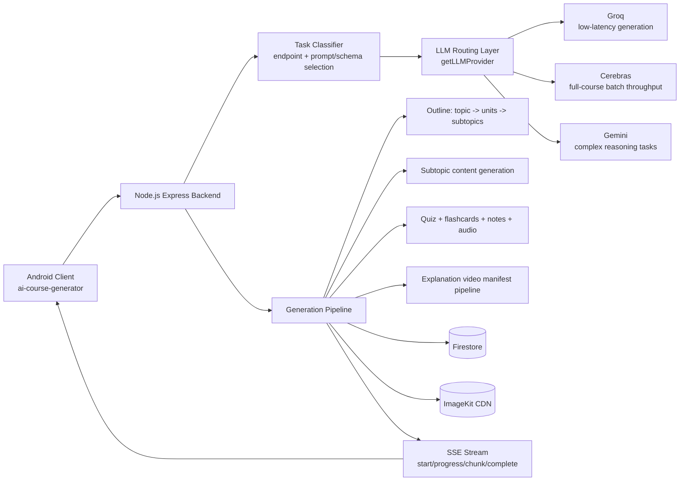

# UpSkill AI

> _"Generates a course. Then enforces that you actually learn it."_

[](https://your-drive-link-here/) [](https://github.com/codeW-Krish/ai-course-backend) [-7F52FF?style=flat&logo=kotlin&logoColor=white)](https://github.com/codeW-Krish/ai-course-generator)   

A production-grade AI learning platform that generates structured courses with quizzes, flashcards, audio overviews, and explanation videos — then makes sure you go through them before moving on.

**The problem it solves:** Users generate a full 50-subtopic course (expensive), then abandon it after subtopic 2. UpSkill AI generates content interactively — one subtopic unlocks only after you pass a quiz on the previous one. No passing score, no next lesson. This enforces real learning checkpoints and eliminates wasted generation costs in a single architectural decision.

**What gets generated per subtopic:** structured notes -> audio overview -> short explanation video -> MCQ + fill-in-the-blank quiz -> flashcards

**The explanation video pipeline (the interesting part):** Generates narration script + synchronized visuals without calling a video-generation LLM. Narration audio and visual components are produced separately and assembled — same output quality at a fraction of the cost. No dependency on a single expensive video API. Dynamic routing across Groq, Cerebras, and Gemini based on latency requirements, throughput, and task complexity. Result: **50 subtopics generated in 24 seconds** via Groq inference with SSE streaming.

**Pedagogical design:** "Why-first" sequencing is built into the system prompt architecture — every subtopic opens with why this matters before teaching what it is. That is a deliberate content structure decision, not a template.

**Stack:** Kotlin (Android client) · Node.js + Express (backend) · Aiven Cloud PostgreSQL (previously in v1) · Firebase · Groq + Cerebras + Gemini APIs · SSE streaming · app write for object storage

## 1. PROJECT NAME

**UpSkill AI**

Android-facing README variant for the UpSkill AI platform, with backend architecture and learning workflow documented for cross-repo consistency.

## 2. Badges

[](https://your-drive-link-here/) [](https://github.com/codeW-Krish/ai-course-backend) [-7F52FF?style=flat&logo=kotlin&logoColor=white)](https://github.com/codeW-Krish/ai-course-generator)   

## 3. WHAT THIS IS

UpSkill AI is a production-grade AI learning platform that generates structured courses with quizzes, flashcards, audio overviews, and explanation videos, then enforces progression through them. The core problem it solves is that users generate a full expensive course and abandon it almost immediately, leaving high generation cost with little actual learning. The system fixes that by generating content interactively and unlocking the next subtopic only after the learner passes a quiz on the current one. This makes learning checkpoints part of the system architecture and directly reduces wasted generation cost.

## 4. DEMO

Walkthrough video or GIF placeholder:

<!-- Replace this with your hosted demo asset -->

[](https://drive.google.com/file/d/YOUR-FILE-ID/view)

## 5. THE INTERESTING ENGINEERING

### A) Quiz-gated interactive generation architecture

**Problem:** generating everything at once leads to cost spikes and unfinished learning paths. **Decision:** the backend interactive flow (`getNextContent`, `getQuiz`, `submitQuiz`) generates content only when needed, then uses quiz completion state to gate progression to the next subtopic. **Trade-offs:** this preserves budget and ties generation to real learner movement, but it requires more state management and careful handling of retries, hearts, and partial failures.

### B) Explanation video pipeline without a video-generation LLM

**Problem:** direct video-generation pipelines reduce control and raise per-request cost. **Decision:** the backend uses a manifest-first sequence in `controller/videoController.js`: script generation, scene planning, visual asset generation, chunk-level TTS, transition planning, and manifest assembly, after which the Android app plays synced scene/audio assets. **Trade-offs:** this is cheaper and gives deterministic playback data, but the client must own playback orchestration and the backend must maintain strict schema and fallback behavior for every stage.

### C) Multi-provider routing layer with request-shaped task logic

**Problem:** latency and throughput profiles differ by provider and by task type. **Decision:** provider adapters are unified under `getLLMProvider`, with Groq as the default low-latency path, Cerebras for full-course single-pass throughput paths, and Gemini available when reasoning-heavy behavior is preferred. **Trade-offs:** this keeps provider switching simple per request, but policy is spread across route/controller decisions instead of one global classifier module.

### D) SSE streaming architecture for real-time generation updates

**Problem:** long content-generation operations need progress visibility for mobile UX. **Decision:** `streamCourseGeneration` emits typed SSE events during generation and persistence (`start`, `chunk`, `progress`, `warning`, `complete`, `error`) so Android can render live status instead of polling a silent request. **Trade-offs:** SSE is simpler than websocket infrastructure for one-way progress streams, but requires strict header/proxy behavior and reconnect handling on unstable networks.

### E) Why-first prompt engineering approach

**Problem:** generated lessons often jump straight to definitions and skip relevance framing. **Decision:** subtopic output contracts require `why_this_matters` and are validated with Zod before persistence, making “why first” an enforced interface rather than a best-effort style choice. **Trade-offs:** this improves consistency in educational framing, but rejects more outputs when providers drift from schema.

## 6. ARCHITECTURE



## 7. CONTENT GENERATION PIPELINE

The backend begins by generating an outline from topic-level input and persisting course hierarchy as units and subtopics with placeholders. Content generation then proceeds by provider-selected strategy: streamed small batches or full-course Cerebras pass, with each subtopic content object including relevance framing and concept structure.

In the interactive progression loop, Android asks for the next content block and receives the first uncompleted subtopic. If content is missing, it is generated immediately; quiz generation is kicked to background where possible, and progression remains locked until quiz results are submitted and validated.

Per subtopic, generated artifacts include structured learning content, MCQ and fill-in-the-blank quiz questions, flashcards, notes, audio overview, and explanation video manifest data. The video path is technically specific: script chunks and scene plans are generated first, visuals are created from either SVG scene rendering or external image providers, narration audio is synthesized per chunk, transitions are planned, and everything is assembled into a manifest with scene-level duration and timing metadata.

This design means the Android player receives deterministic scene instructions rather than one opaque video blob. The app can therefore render visuals and play audio in lockstep while preserving a low-cost backend pipeline that does not depend on a direct video-generation LLM.

## 8. LLM ROUTING LOGIC

Routing is implemented in `providers/LLMProviders.js` and applied by endpoint-level task shape. Groq is the default path for most operations because controllers use Groq as default provider and the Groq adapter returns strict JSON outputs quickly for prompt-driven tasks.

Cerebras is selected for high-throughput course generation paths where full-course payloads are generated and then persisted with progress events. Gemini is available for cases where stronger reasoning behavior is useful and can be selected via provider/model parameters.

In practical terms, routing here is hybrid: explicit provider selection from request inputs plus controller-defined generation strategy. The quality gate remains schema validation, which prevents malformed model outputs from being persisted or streamed as completed content.

## 9. TECH STACK

| Layer | Technology | Why |
|---|---|---|
| Mobile Client | Android (separate repo) | Consumes generated course artifacts and real-time progress streams |
| API Server | Node.js, Express 5 | Endpoint orchestration, middleware, and SSE support |
| Auth | Firebase Auth + JWT middleware | Authenticated access to generation and progress endpoints |
| Data Store | Firebase Firestore | Hierarchical course data + generated artifact storage |
| LLM Router | Provider switchboard in backend | Unified interface for Groq/Cerebras/Gemini/GLM |
| LLM Providers | Groq, Cerebras, Gemini, GLM | Latency, throughput, and reasoning trade-offs across tasks |
| Validation | Zod | Contract enforcement for model outputs |
| Streaming | Server-Sent Events | Real-time generation progress to Android client |
| Media Pipeline | SVG generation, image providers, TTS, ImageKit | Cost-controlled explanation video and audio assembly |
| Platform Context | Aiven Cloud PostgreSQL (project context) | Included in broader platform narrative; backend runtime in this codebase remains Firestore-centric |

## 10. RUNNING LOCALLY

This README variant targets the Android repo context, but backend startup commands remain the source of truth for local end-to-end testing.

### Backend local commands (from backend repo)

```bash
cd backend
npm install
npm run dev
```

Optional production start:

```bash
npm start
```

Health check:

```bash
GET http://localhost:3030/api/health
```

### Backend configuration notes

- Backend expects environment values in `backend/.env` (this codebase does not include `.env.example`).
- Firebase credentials are loaded either from `FIREBASE_SERVICE_ACCOUNT` env JSON or from `backend/cert/serviceAccountKey.json`.
- For feature-complete runs, configure at least one LLM provider key and required media/CDN keys.

### Backend test commands

```bash
npm run test:auth-contract
node test/integration-test.js
node test/p0-test.js
node test/db-test.js
node test/phaseab-smoke.js
```

## 11. WHAT I LEARNED

I learned that the most important routing decisions are not only in `getLLMProvider` but also in generation strategy functions like `processStreamingBatches` and `processCerebrasBatch` inside `controller/course.js`. What surprised me most was how strongly persistence and progress signaling influenced end-to-end speed once provider latency dropped, especially in SSE generation paths. My prompt engineering lesson came from enforcing `why_this_matters` in both prompt and schema, because doing it in `prompts/SubTopicBatchPrompt.js` plus `llm/outlineSchemas.js` produced far more stable pedagogy than post-processing. If I were to change one architectural piece, I would add an explicit policy-driven task classifier shared by `getNextContent` and `buildManifest` so provider and model choices are centrally versioned instead of route-local defaults.
